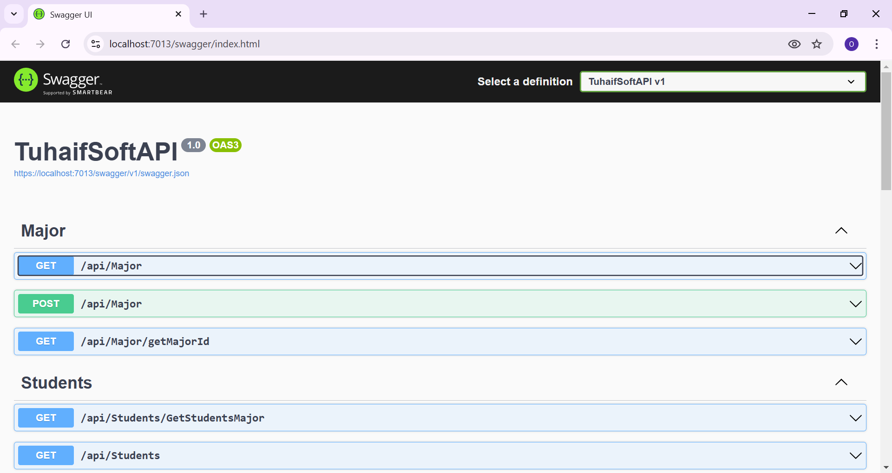
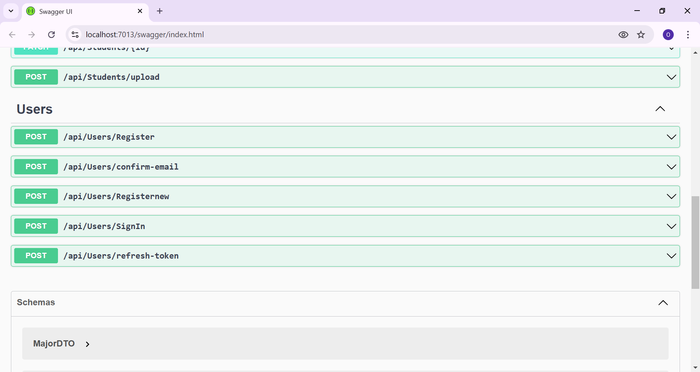
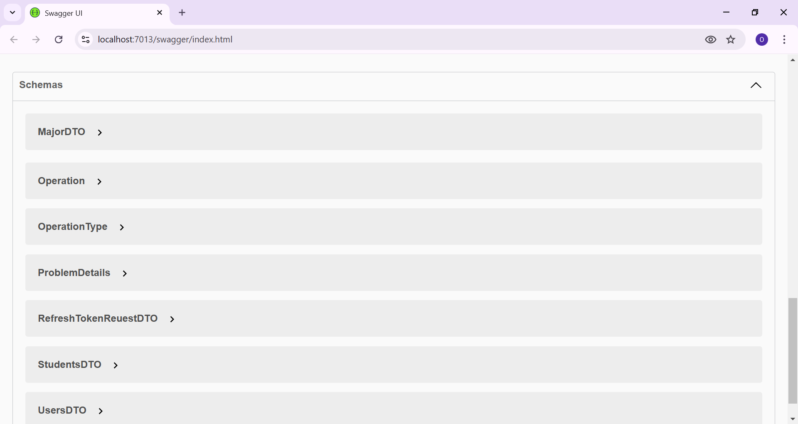

"# APITuhaifSoft" 
API in ASP.NET core with three Categories of Endpoints, first one for Users and User Account managment, Register,login,refershToken and more, then Endpoins for Majors and finally For
First Image for my API

Second Image for my API

Thierd Image for my API

fourth Image for my API

